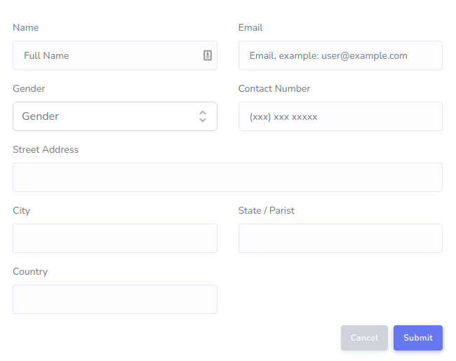
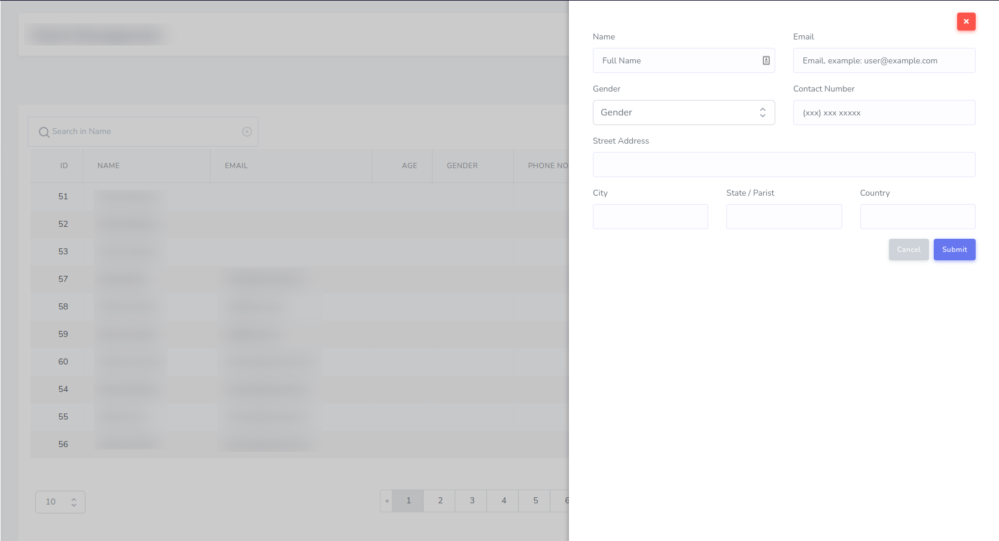

## Examples


### FormComponent Example

```php
namespace App\Http\Livewire\Clients;

use Bastinald\LaravelLivewireForms\Components\Button;
use Bastinald\LaravelLivewireForms\Components\FormComponent;
use Bastinald\LaravelLivewireForms\Components\Input;
use Bastinald\LaravelLivewireForms\Components\Select;

class CreateClientForm extends FormComponent
{
    public $gridClass = 'row';

    public function fields()
    {
        return [
            Input::make('name', 'Name')
                ->col_md()
                ->placeholder('Full Name'),
            Input::make('email', 'Email')
                ->type('email')
                ->placeholder('Email, example: user@example.com')
                ->col_md(),
            Select::make('gender', 'Gender')
                ->placeholder('Gender')
                ->options(['Male', 'Female'])
                ->col_md()
                ->addAttrs(['class' => 'd-block w-full']),
            Input::make('phone_no', 'Contact Number')
                ->placeholder('(xxx) xxx xxxxx')
                ->col_md(),
            Input::make('street_address', 'Street Address')
                ->col_md(),
            Input::make('city', 'City')
                ->col_md(),
            Input::make('state', 'State / Parist')
                ->col_md(),
            Input::make('country', 'Country')
                ->col_md(),
        ];
    }

    public function buttons()
    {
        return [
            Button::make('Cancel', 'secondary')->url(route('team.index')),
            Button::make()->click('submit'),
        ];
    }
}
```

#### Form View




### FormSliderComponent Example

```php
namespace App\Http\Livewire\Clients;

use Bastinald\LaravelLivewireForms\Components\Button;
use Bastinald\LaravelLivewireForms\Components\FormSliderComponent;
use Bastinald\LaravelLivewireForms\Components\Input;
use Bastinald\LaravelLivewireForms\Components\Select;

class CreateClientForm extends FormSliderComponent
{

    public $btnIcon = 'fa fa-user';
    public $btnText = 'Add Client';
    public $gridClass = 'row';

    ...

}
```


#### Form Slider View


